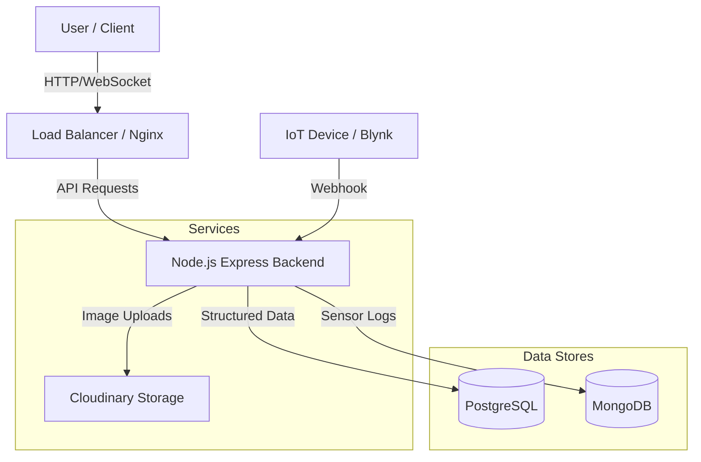

# 🌱 Decommoir
> **Smart Maggot Waste Decomposition Monitoring System**


**Decommoir** is a cutting-edge IoT-enabled platform designed to revolutionize organic waste management in schools through **Black Soldier Fly (BSF) Maggot** bioconversion. It provides real-time monitoring, data analytics, and comprehensive management tools for maggot cultivation devices.

---

## 🚀 Key Features

### 📊 Real-Time Monitoring
- **Live Sensor Data**: Monitor temperature, humidity, and other critical metrics from your maggot devices in real-time.
- **IoT Integration**: Seamlessly connected with **Blynk** webhooks for instant data synchronization.
- **Hybrid Database**: Utilizes **MongoDB** for high-frequency sensor logs and **PostgreSQL** for structured relational data.

### 🏫 School & Device Management
- **Multi-Role Access**: Granular permissions for **Admins**, **School Admins**, and **Guests**.
- **Device Tracking**: Manage multiple "Maggot Devices" across different schools.
- **Lifecycle Logging**: Track deployment dates, maintenance schedules, and device health.

### 📈 Data Analytics & Logging
- **Harvest Logs**: Record and visualize maggot harvest volumes over time.
- **Waste Input Tracking**: Log food waste inputs with image evidence uploads.
- **Interactive Dashboards**: Beautiful charts and graphs powered by **Chart.js**.

### 🛠️ Maintenance & Operations
- **Maintenance Logs**: Keep a digital history of all maintenance activities.
- **Alerts & Notifications**: (Planned) Get notified when environmental conditions go out of range.

---

## 🛠️ Tech Stack

### Frontend
- **Framework**: [React](https://reactjs.org/) (v19) with [Vite](https://vitejs.dev/)
- **Styling**: [TailwindCSS](https://tailwindcss.com/)
- **Icons**: [React Icons](https://react-icons.github.io/react-icons/) & [Feather](https://feathericons.com/)
- **Charts**: [Chart.js](https://www.chartjs.org/) & [React-Chartjs-2](https://react-chartjs-2.js.org/)
- **HTTP Client**: [Axios](https://axios-http.com/)

### Backend
- **Runtime**: [Node.js](https://nodejs.org/)
- **Framework**: [Express.js](https://expressjs.com/)
- **Databases**:
  - **PostgreSQL**: For Users, Schools, Devices, and Operational Logs.
  - **MongoDB**: For high-volume IoT Sensor Data.
- **Real-time**: WebSocket (ws) integration.
- **Authentication**: JWT (JSON Web Tokens) & Google Auth.
- **File Storage**: Cloudinary (for waste images).

### DevOps & Infrastructure
- **Containerization**: [Docker](https://www.docker.com/)
- **CI/CD**: [Jenkins](https://www.jenkins.io/)
- **Process Management**: Nodemon

---

## 🏗️ Architecture

Decommoir uses a **Hybrid Database Architecture** to optimize for both data integrity and write performance.



---

## 🏁 Getting Started

### Prerequisites
- Node.js (v18+)
- PostgreSQL
- MongoDB
- Docker (optional, for containerized deployment)

### 🔧 Installation

1.  **Clone the repository**
    ```bash
    git clone https://github.com/patuyyy/decommoir.git
    cd decommoir
    ```

2.  **Setup Backend**
    ```bash
    cd backend
    npm install
    
    # Create .env file
    cp .env.example .env
    # Update .env with your DB credentials
    
    npm start
    ```

3.  **Setup Frontend**
    ```bash
    cd ../frontend
    npm install
    
    # Create .env file
    cp .env.example .env
    
    npm run dev
    ```

4.  **Database Setup**
    - Import the PostgreSQL schema from `psql_table.sql`.
    - Ensure MongoDB is running and the URI is correctly set in `.env`.

---


## 🤝 Contributing

Contributions are welcome! Please fork the repository and submit a pull request for any enhancements or bug fixes.

## 📄 License

This project is licensed under the ISC License.

---

<p align="center">
  Made with ❤️ by <b>Ihsan</b>
</p>
